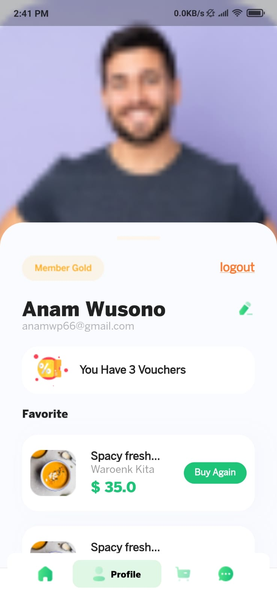

# Food Ninja Application ( In Development )

its an application is responsble for delivering foods from several Resturants to the users and help them to get more experience about the available various fast foods around them.

# Technologies

- Flutter to make Cross-platform application for all users ( ios - android )
- Bloc ( State Managment && Architecture pattern )
- Firebase Auth - Firebase Firestore - Firebase Firestorage
- Shared preference
- location packages

# Properties of Application

- beautiful UI ( +30 screens )
- Responsive
- Registration and Login
- Add Current Location
- Phone number verfication
- User Profile

# Under Development

- Login with Google & Facebook
- Dashboard for admin to control restaurants and menus
- chat user with application's employee
- connect the UI with Firebase (as Backend)

# Screenshots

         

        

        

        

       

